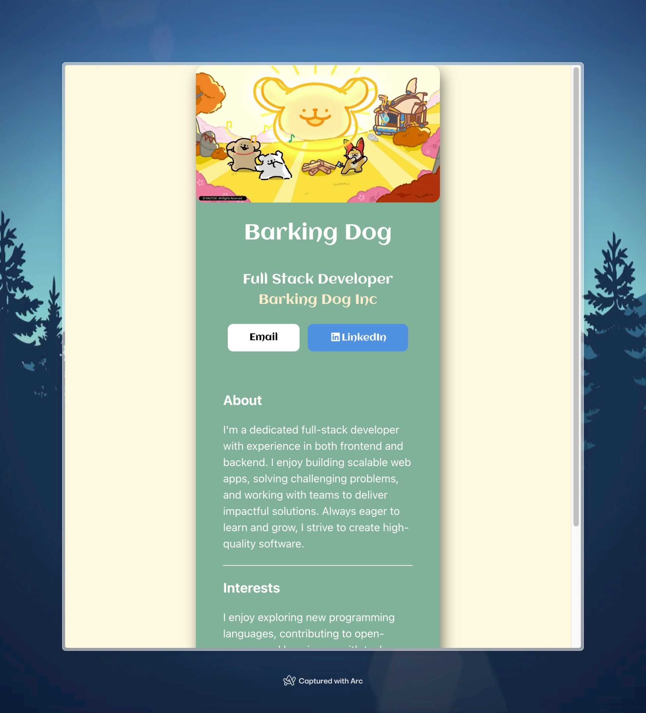

<div align="center">
    <h1 color="purple">
        Scrimba
        <br/> 
        Business Card</h1>
</div>
<br/>
<div align="center">
    
</div>
<br/>

## Introduction

> This card displays the life of Maltess, a pair of lovely dogs from Korea.

## Features

1. The static page
2. Tech Stack:
   - React `19.0.0`
   - Javascript
   - Vite
   - Font-awesome
3. Structure

```
├── public/
│ ├── Favicon.png # Site favicon
├── src/
│ ├── assets/
│ ├── components/
│ │ ├── Article.jsx # Article content component
│ │ ├── BusinessCard.jsx # Main business card container
│ │ ├── Footer.jsx # Footer with social links
│ │ └── Header.jsx # Header with profile info
│ ├── styles/
│ │ ├── article.css # Article component styles
│ │ ├── card.css # Business card styles
│ │ ├── footer.css # Footer component styles
│ │ └── header.css # Header component styles
│ ├── App.css # Main app styles
│ ├── App.jsx # Root App component
│ ├── index.css # Global styles
│ ├── index.js # Additional utilities
│ └── main.jsx # React app entry point
```

1. **📁 public/** - Static assets served directly
2. **📁 src/assets/** - Images and media files used in components
3. **📁 src/components/** - React components organized by functionality
4. **📁 src/styles/** - Component-specific CSS files
5. **📄 Configuration files** - Vite, ESLint, and package management
6. **📄 Entry points** - HTML template and React app initialization

## Installation

1. **Clone this repository** `git clone https://github.com/boy-johnny/scrimba-business-card`
2. **Install the deps**: `cd scrimba-business-card\ && pnpm install`

## Contribution

Thanks for [Scrimba](https://scrimba.com) for their tutorial and design
2025 © Brian Huang
